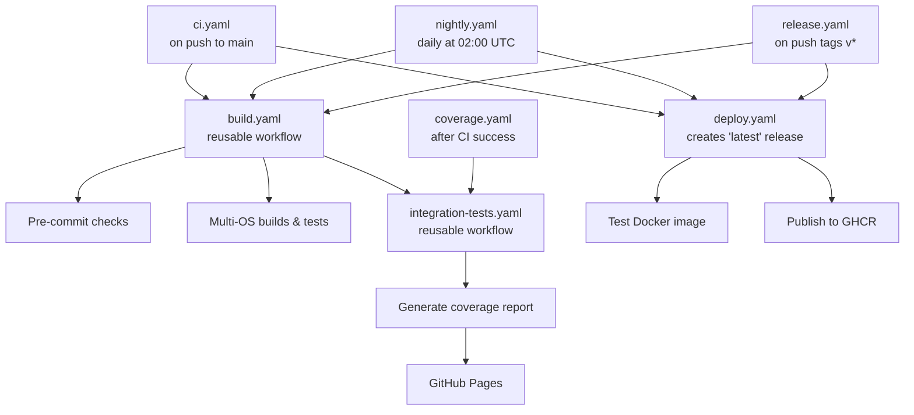

# GitHub Workflows

This directory contains the CI/CD automation for the SOVD Playground.

## Workflow Architecture

The CI/CD pipeline is split into focused, reusable workflows:

## Release tags

- `latest` - Latest successful main branch build
- `nightly` - Daily automated build at 02:00 UTC
- `vX.Y.Z` - Versioned production releases
