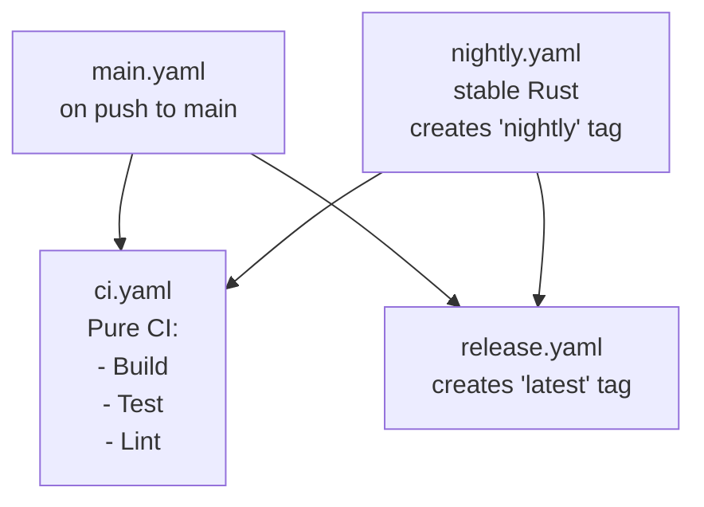

# GitHub Workflows

This directory contains the CI/CD automation for the SOVD Playground.

## Workflow Architecture

The CI/CD pipeline is split into focused, reusable workflows:

```mermaid
graph TD
    Main[main.yaml<br/>on push to main] --> CI[ci.yaml<br/>Pure CI:<br/>- Build<br/>- Test<br/>- Lint]
    Main --> Release[release.yaml<br/>creates 'latest' tag]
    Nightly[nightly.yaml<br/>stable Rust<br/>creates 'nightly' tag] --> CI
    Nightly --> Release
```

## Release tags

- `latest` - Latest successful main branch build
- `nightly` - Daily automated build with stable Rust
- `vX.Y.Z` - Manual versioned releases (future)
