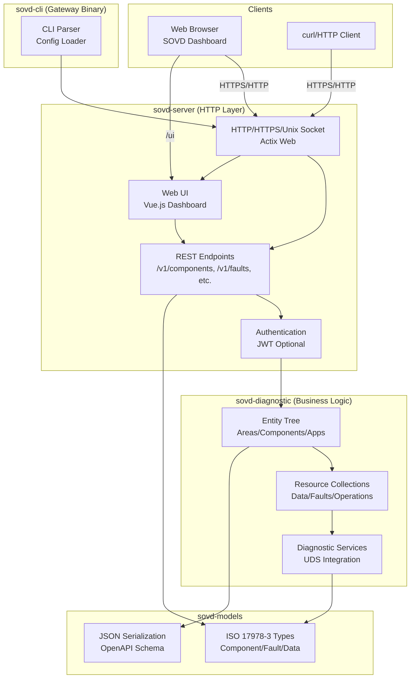

# Architecture

## Component Overview

- **sovd-models** - ISO 17978-3 data structures and types
- **sovd-server** - REST endpoint implementation with HTTP/HTTPS/Unix-socket support
- **sovd-diagnostic** - Entity management and diagnostic services
- **sovd-cli** - Gateway binary with CLI interface (reference implementation)
- **sovd-ui** - Vue.js based web UI dashboard

## System Diagram

